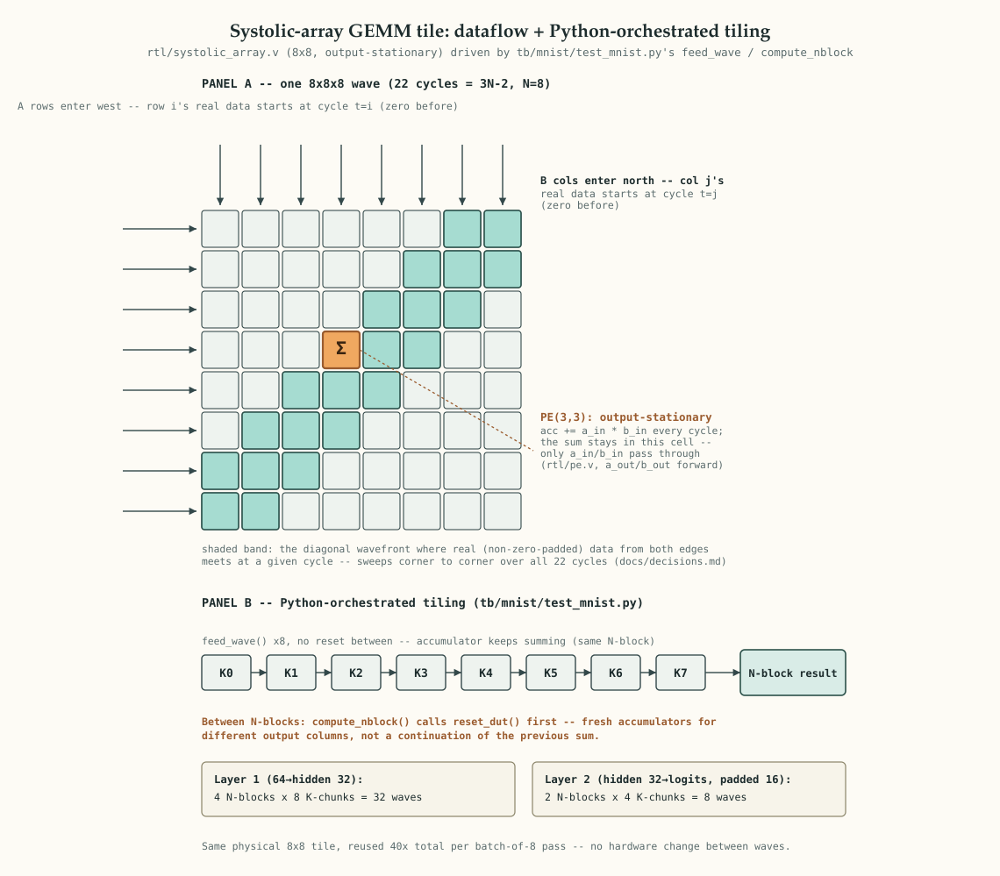

# Hardware GEMM accelerator for neural network inference

A systolic array-based hardware accelerator, designed in Verilog and verified in
simulation, that runs a real trained neural network to classify handwritten
digits (MNIST). Built as a portfolio project for RTL/logic design internship
recruiting.

## What this is

Instead of running inference as software on a CPU/GPU, this project designs the
actual circuitry that performs it: a grid of multiply-accumulate processing
elements (a systolic array) that computes matrix multiplication (GEMM) directly
in hardware. GEMM is the compute core real CNN/TPU-style accelerators are built
around — convolutions get lowered to matrix multiplies (e.g. via im2col) before
hitting hardware like this. The network currently running on this array is a
bias-free MLP, not a CNN; there's no convolution op implemented (yet).

## Architecture



The 8x8 tile (`rtl/systolic_array.v`) only computes one 8x8x8 matrix multiply per pass. Real classification
needs bigger matmuls, so `tb/mnist/test_mnist.py` tiles each MLP layer into repeated passes through that
same tile: K-chunks (the reduction dimension) accumulate back-to-back with no reset between them, while
N-blocks (independent output columns) get a fresh reset — see `docs/decisions.md` for the full proof that
this can't cross-contaminate between chunks.

## Phases

- **Phase 1 — core deliverable**: a single verified 8x8 systolic array tile,
  running real MNIST classification, with a cocotb testbench.
- **Phase 2 — scale up**: multiple tiles connected by a simple network-on-chip
  (NoC), plus Yosys synthesis for real area/timing numbers.
- **Phase 3 — stretch goal**: full OpenLane physical design flow, possible
  Tiny Tapeout submission.

## Toolchain

| Tool | Role |
|---|---|
| Verilog | hardware description language — the design itself |
| Icarus Verilog / Verilator | simulate the design |
| cocotb | Python-based testbenches |
| Surfer | waveform viewing / debugging |
| PyTorch | train + quantize the reference model |
| Yosys | synthesis to gate-level netlist |
| OpenLane | physical design / layout (Phase 3) |

## Demo

[`demo/mnist_demo.html`](demo/mnist_demo.html) — open in a browser to see 8 real MNIST test digits
classified end-to-end by the simulated hardware, alongside the true labels and the original trained
model's own predictions.

The quantized model reaches **94.82% accuracy on the full 10,000-image MNIST test set** (vs. 94.85% for
the original float model, before quantization) — see [`model/evaluate_quantized.py`](model/evaluate_quantized.py),
which replicates the exact int8 datapath already proven bit-exact against the hardware tile in
[`tb/mnist/test_mnist.py`](tb/mnist/test_mnist.py). (No throughput/clock-speed number yet — that requires
real Phase 2 synthesis timing, not simulation.)

## Waveforms

[`docs/waveforms/test_mnist.fst`](docs/waveforms/test_mnist.fst) is a real waveform dump from
`tb/mnist/test_mnist.py` (via cocotb/Icarus's built-in `make WAVES=1`, no RTL changes needed), and
[`docs/waveforms/test_mnist.surf.ron`](docs/waveforms/test_mnist.surf.ron) is a saved
[Surfer](https://surfer-project.org/) session pre-selecting a sensible signal set: `clk`, `reset`,
`valid_in`, the `a_west`/`b_north` buses, and three individual PE accumulator registers (corner cells
`row[0].col[0]` and `row[7].col[7]`, plus center cell `row[3].col[3]`) out of the 64 available. Open it
with:

```
brew install surfer
surfer docs/waveforms/test_mnist.fst -s docs/waveforms/test_mnist.surf.ron
```

(GTKWave is the more commonly-cited waveform viewer, but its macOS cask is currently broken on macOS 14+
— Gatekeeper refuses to open it. Surfer is an actively-maintained, native-Apple-Silicon alternative that
opens `.fst` files directly, no VCD conversion needed.)

## Status

See the [GitHub Project board](../../projects) for live task tracking, and
[`docs/learnings.md`](docs/learnings.md) for a running log of problems hit and
how they were solved.

## Repo layout

```
rtl/          Verilog source
tb/           cocotb testbenches
model/        PyTorch training + quantization scripts
demo/         static HTML demo of hardware results
sim/          simulation build artifacts (gitignored)
docs/         learnings log, design decisions
```
