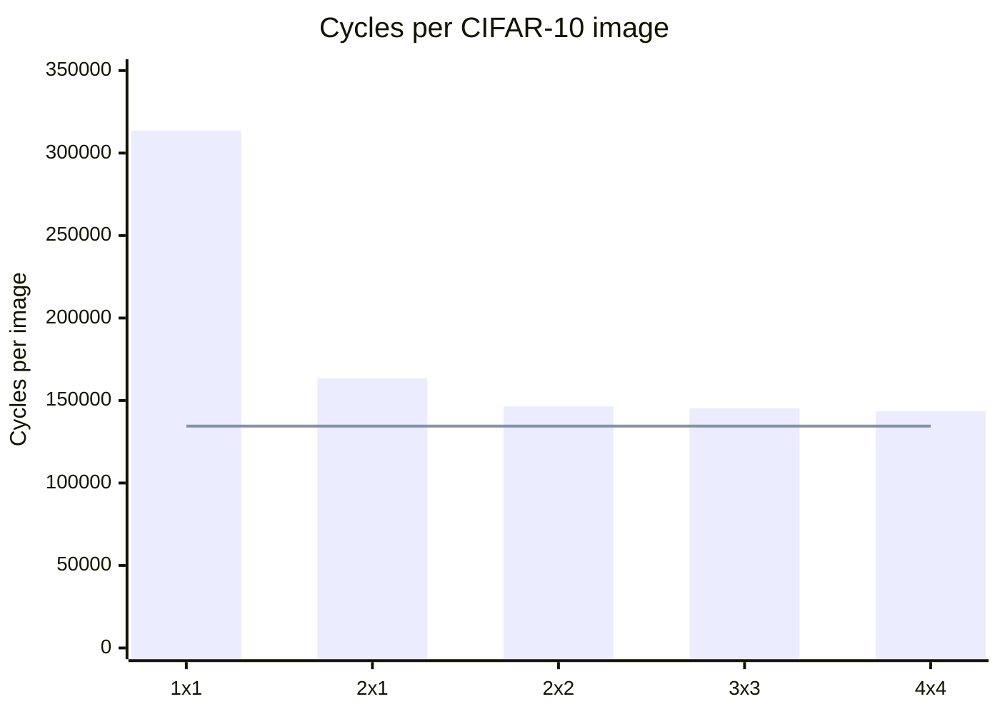

# Mesh scaling study

Generated by `make scaling` in `tb/accel/` (`tb/accel/scaling_report.py`); do not edit by hand.

The frozen CIFAR-10 program, recompiled for each mesh, ran on `rtl/accel.v` over 128 test images per mesh from one `start` pulse.
Every run's final activation memory is bit-exact against `compiler/golden.py`, and its logits and last-image activations are bit-exact against `model/cifar_reference.py`.
int8 accuracy is 88.3% on every mesh: the mesh changes the schedule, never the result.

## Results

| Mesh | Tiles | Cycles per image | Speedup vs 1x1 | Mesh throughput (tiles busy) | MAC utilization per tile | Corner injection busy | Corner injection stalled |
|---|---:|---:|---:|---:|---:|---:|---:|
| 1x1 | 1 | 313,516 | 1.00x | 0.42 | 42.1% | 44.6% | 53.1% |
| 2x1 | 2 | 163,419 | 1.92x | 0.81 | 40.4% | 83.9% | 11.8% |
| 2x2 | 4 | 146,430 | 2.14x | 0.90 | 22.6% | 92.8% | 2.1% |
| 3x3 | 9 | 145,415 | 2.16x | 0.91 | 10.1% | 92.9% | 1.9% |
| 4x4 | 16 | 143,533 | 2.18x | 0.92 | 5.8% | 94.0% | 0.8% |

- *Mesh throughput* is 64-MAC operand slots fed into all arrays per cycle: 1.00 would be one tile computing every cycle.
- *Corner injection* is node (0,0)'s router LOCAL input, where every OPERAND and GO flit enters the mesh and tile (0,0)'s RESULT flits leave it (`rtl/node_perf.v` `lcl_in_xfer`/`lcl_in_stall` over run cycles).

Measured cycles per image (bars) against the injection-port floor of 134,482 cycles per image (line):

Measured speedup over 1x1 (bars) against linear scaling in the tile count (line):

## Where the command processor's cycles go

Run cycles by what the command processor did (`rtl/cmd_perf.v`); *Other* is the remainder.

| Mesh | OPERAND slots | GO beats | Injection stall | WAIT/END stall | Credit stall | Other |
|---|---:|---:|---:|---:|---:|---:|
| 1x1 | 42.1% | 0.8% | 54.7% | 0.1% | 0.0% | 2.3% |
| 2x1 | 80.8% | 1.5% | 13.4% | 0.2% | 0.0% | 4.1% |
| 2x2 | 90.2% | 1.6% | 3.0% | 0.2% | 0.0% | 4.9% |
| 3x3 | 90.9% | 1.6% | 2.4% | 0.2% | 0.0% | 4.9% |
| 4x4 | 92.0% | 1.7% | 1.1% | 0.2% | 0.0% | 5.0% |

Node (0,0)'s outgoing ports, busy cycles over run cycles:

| Mesh | East link | North link | LOCAL out (tile (0,0)'s operands, all RESULTs) |
|---|---:|---:|---:|
| 1x1 | 0.0% | 0.0% | 44.6% |
| 2x1 | 41.1% | 0.0% | 44.4% |
| 2x2 | 45.9% | 21.5% | 28.0% |
| 3x3 | 60.2% | 19.0% | 16.9% |
| 4x4 | 68.8% | 16.5% | 12.1% |

## Where the corner saturates and why

The corner saturates at **2x2**: it runs within 2.0% of the fastest mesh measured (4x4), and no larger mesh measured is more than 2.0% faster, while the tile count grows 4x.

**The corner's injection port is the bottleneck, and its capacity is exactly one tile.**
Every OPERAND and GO flit enters the mesh through node (0,0)'s single router LOCAL input, one flit per cycle.
One OPERAND flit is one slot, an 8-byte A column and an 8-byte B row, which is 64 MACs of work for the tile it reaches: one tile's peak rate.
So no mesh can do more MACs per cycle than one fully busy tile.
Each image needs 134,482 injected flits (2,370 BLOCKs of 55.7 slots on average, plus one GO each), which is a floor under every mesh; 4x4 runs at 93.7% of the floor's speed, with the corner's injection port busy 94.0% of cycles.
Mesh throughput tops out at 0.92 tiles busy, and MAC utilization per tile falls from 42.1% to 5.8% as tiles are added.

**Below saturation, a single tile cannot overlap loading and computing.**
A tile backpressures OPERAND and GO flits while it computes and streams results (issue #44, one operand buffer), so on 1x1 loading and computing take turns: the corner's injection port is stalled 53.1% of cycles and the mesh runs at 42.9% of the floor's speed.
A second tile loads while the first computes: 2x1 is 1.92x faster than 1x1, and the larger meshes hide the stalls that remain (the injection stall falls to 0.8% on 4x4).

**The rest is a fixed cost per BLOCK.** Past the slots, the GO beats, and the stalls, the command processor spends 3.03 cycles per BLOCK on 4x4 (3.04, 2.85, 3.04, 3.04, 3.03 across the meshes), independent of the mesh.
That matches `rtl/dma_gather.v`'s three-stage pipeline (S0, S1, S2) refilling between BLOCKs: `done` pulses when the GO beat is accepted, and `rtl/cmd_seq.v` starts the next BLOCK only then, so each BLOCK's first slot waits for the pipeline to fill again.

What this decides for the next phase is recorded in `docs/decisions.md` (2026-09-28, mesh scaling study).
