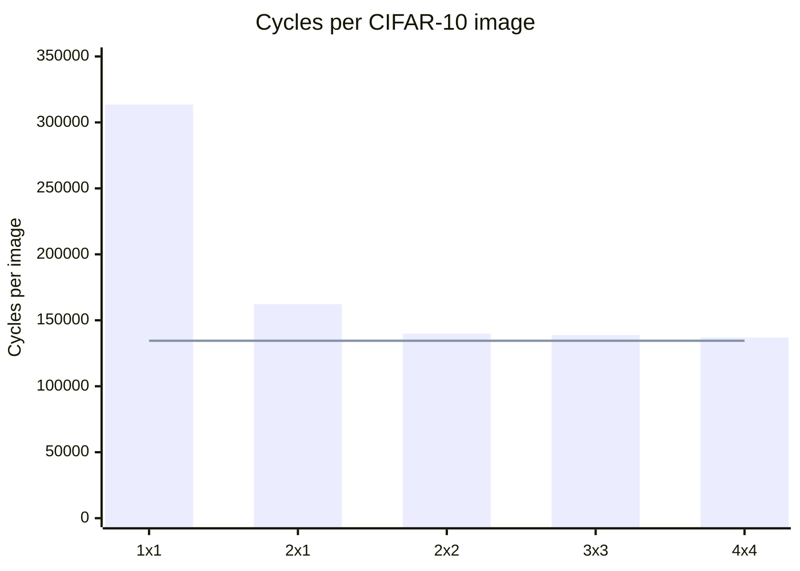
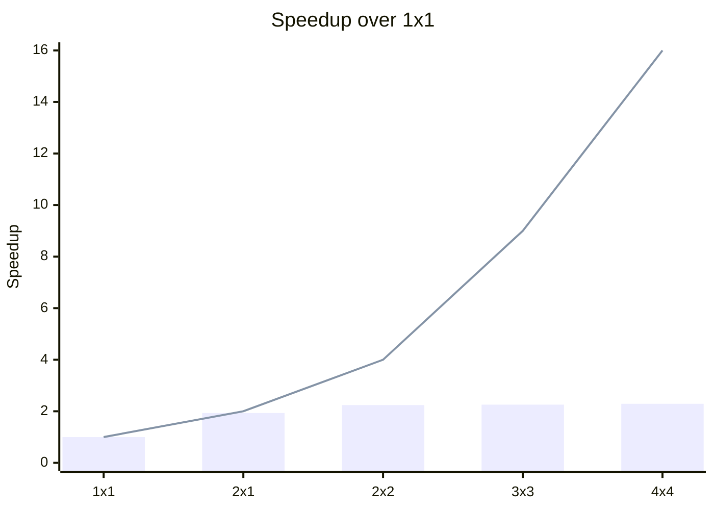

# Mesh scaling study

Generated by `make scaling` in `tb/accel/` (`tb/accel/scaling_report.py`); do not edit by hand.

The frozen CIFAR-10 program, recompiled for each mesh, ran on `rtl/accel.v` over 128 test images per mesh from one `start` pulse.
Every run's final activation memory is bit-exact against `compiler/golden.py`, and its logits and last-image activations are bit-exact against `model/cifar_reference.py`.
int8 accuracy is 88.3% on every mesh: the mesh changes the schedule, never the result.

## Results

| Mesh | Tiles | Cycles per image | Speedup vs 1x1 | Mesh throughput (tiles busy) | MAC utilization per tile | Corner injection busy | Corner injection stalled |
|---|---:|---:|---:|---:|---:|---:|---:|
| 1x1 | 1 | 313,516 | 1.00x | 0.42 | 42.1% | 44.6% | 55.3% |
| 2x1 | 2 | 162,310 | 1.93x | 0.81 | 40.7% | 84.5% | 15.3% |
| 2x2 | 4 | 139,913 | 2.24x | 0.94 | 23.6% | 97.1% | 2.6% |
| 3x3 | 9 | 138,889 | 2.26x | 0.95 | 10.6% | 97.3% | 2.4% |
| 4x4 | 16 | 136,919 | 2.29x | 0.96 | 6.0% | 98.5% | 1.2% |

- *Mesh throughput* is 64-MAC operand slots fed into all arrays per cycle: 1.00 would be one tile computing every cycle.
- *Corner injection* is node (0,0)'s router LOCAL input, where every OPERAND and GO flit enters the mesh and tile (0,0)'s RESULT flits leave it (`rtl/node_perf.v` `lcl_in_xfer`/`lcl_in_stall` over run cycles).

Measured cycles per image (bars) against the injection-port floor of 134,482 cycles per image (line):

Measured speedup over 1x1 (bars) against linear scaling in the tile count (line):

## Where the command processor's cycles go

Run cycles by what node (0,0)'s injection port did (`rtl/cmd_perf.v`).
Every category is counted at that one port, so each run cycle is in exactly one and the rows sum to 100%: an OPERAND or GO flit injected, a flit stalled, or, with no flit at the port, a WAIT/END stall, else a credit stall, else *Other*.

| Mesh | OPERAND flits | GO flits | Injection stall | WAIT/END stall | Credit stall | Other |
|---|---:|---:|---:|---:|---:|---:|
| 1x1 | 42.1% | 0.8% | 57.0% | 0.1% | 0.0% | 0.0% |
| 2x1 | 81.4% | 1.5% | 16.9% | 0.2% | 0.0% | 0.1% |
| 2x2 | 94.4% | 1.7% | 3.6% | 0.2% | 0.0% | 0.1% |
| 3x3 | 95.1% | 1.7% | 2.9% | 0.2% | 0.0% | 0.1% |
| 4x4 | 96.5% | 1.7% | 1.4% | 0.3% | 0.0% | 0.1% |

Node (0,0)'s outgoing ports, busy cycles over run cycles:

| Mesh | East link | North link | LOCAL out (tile (0,0)'s operands, all RESULTs) |
|---|---:|---:|---:|
| 1x1 | 0.0% | 0.0% | 44.6% |
| 2x1 | 41.4% | 0.0% | 44.7% |
| 2x2 | 48.1% | 22.5% | 29.3% |
| 3x3 | 63.0% | 19.9% | 17.7% |
| 4x4 | 72.1% | 17.3% | 12.6% |

## Where the corner saturates and why

The corner saturates at **2x2**: it runs within 2.2% of the fastest mesh measured (4x4), and no larger mesh measured is more than 2.2% faster, while the tile count grows 4x.

**The corner's injection port is the bottleneck, and its capacity is exactly one tile.**
Every OPERAND and GO flit enters the mesh through node (0,0)'s single router LOCAL input, one flit per cycle.
One OPERAND flit is one slot, an 8-byte A column and an 8-byte B row, which is 64 MACs of work for the tile it reaches: one tile's peak rate.
So no mesh can do more MACs per cycle than one fully busy tile.
Each image needs 134,482 injected flits (2,370 BLOCKs of 55.7 slots on average, plus one GO each), which is a floor under every mesh; 4x4 runs at 98.2% of the floor's speed, with the corner's injection port busy 98.5% of cycles.
Mesh throughput tops out at 0.96 tiles busy, and MAC utilization per tile falls from 42.1% to 6.0% as tiles are added.

**Below saturation, a single tile cannot overlap loading and computing.**
A tile backpressures OPERAND and GO flits while it computes and streams results (issue #44, one operand buffer), so on 1x1 loading and computing take turns: the corner's injection port is stalled 55.3% of cycles and the mesh runs at 42.9% of the floor's speed.
A second tile loads while the first computes: 2x1 is 1.93x faster than 1x1, and the larger meshes hide the stalls that remain (the injection stall falls to 1.2% on 4x4).

**What is left is a fixed cost per layer, not a refill gap.** *Other* is 106 cycles per image on 4x4 (106, 106, 106, 106, 106 across the meshes), 0.045 cycles per BLOCK.
It is the command processor's non-BLOCK commands (one cycle each: a layer's register ADDs, LOOP, ENDLOOP) and the DMA pipeline refilling after each WAIT, which the image's BLOCKs amortize.
`rtl/dma_gather.v` carries every value a BLOCK still needs (`k_chunks`, the caller's opaque tag) down its own pipeline and hands off at the cycle it emits the BLOCK's last OPERAND beat, and `rtl/cmd_seq.v` (4.3a, issue #81) issues the next BLOCK as soon as the DMA is ready, while the previous one drains, so its first slot follows the previous BLOCK's GO beat with no gap.
Before 4.3a the DMA idled about 3 cycles refilling its pipeline between every two BLOCKs.

What this decides for the next phase is recorded in `docs/decisions.md` (2026-09-28, mesh scaling study).
